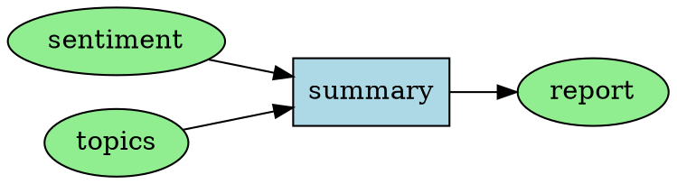

# DagEngine API Reference

The main orchestration engine that executes your workflow.

---

## 📋 Overview

**DagEngine** is the core class that:
- ✅ Builds dependency graph (DAG)
- ✅ Executes dimensions in optimal order
- ✅ Manages provider retries and fallbacks
- ✅ Tracks costs and token usage
- ✅ Handles errors gracefully

**Import:**
```typescript
import { DagEngine } from '@ivan629/dag-ai';
```

---

## 🔧 Constructor

### `new DagEngine(config: EngineConfig)`

Creates a new engine instance.

**Signature:**
```typescript
constructor(config: EngineConfig)
```

**Parameters:**

```typescript
interface EngineConfig {
  // REQUIRED
  plugin: Plugin;

  // REQUIRED: Choose one
  providers?: ProviderAdapter | ProviderAdapterConfig;
  registry?: ProviderRegistry;

  // OPTIONAL: Execution Control
  concurrency?: number;           // Default: 5
  continueOnError?: boolean;      // Default: true

  // OPTIONAL: Retry & Timeout
  maxRetries?: number;            // Default: 3
  retryDelay?: number;            // Default: 1000 (ms)
  timeout?: number;               // Default: 60000 (60s)
  dimensionTimeouts?: Record<string, number>;

  // OPTIONAL: Cost Tracking
  pricing?: PricingConfig;
}
```

**Examples:**

**Basic Setup:**
```typescript
import { DagEngine, Plugin } from '@ivan629/dag-ai';

const engine = new DagEngine({
  plugin: new MyPlugin(),
  providers: {
    anthropic: { apiKey: process.env.ANTHROPIC_API_KEY }
  }
});
```

**Full Configuration:**
```typescript
const engine = new DagEngine({
  // Required
  plugin: new MyPlugin(),
  
  // Providers
  providers: {
    anthropic: { apiKey: process.env.ANTHROPIC_API_KEY },
    openai: { apiKey: process.env.OPENAI_API_KEY },
    gemini: { apiKey: process.env.GEMINI_API_KEY }
  },
  
  // Execution control
  concurrency: 10,           // Process 10 sections at once
  continueOnError: true,     // Keep going if dimension fails
  
  // Retry & timeout
  maxRetries: 5,             // Try 5 times per provider
  retryDelay: 2000,          // Base delay: 2s (exponential backoff)
  timeout: 120000,           // Global timeout: 120s
  dimensionTimeouts: {
    'slow_analysis': 180000  // This dimension: 180s
  },
  
  // Cost tracking
  pricing: {
    models: {
      'claude-sonnet-4-5-20250929': {
        inputPer1M: 3.00,
        outputPer1M: 15.00
      },
      'gpt-4o': {
        inputPer1M: 2.50,
        outputPer1M: 10.00
      }
    }
  }
});
```

**With ProviderAdapter Instance:**
```typescript
import { ProviderAdapter } from '@ivan629/dag-ai';

const adapter = new ProviderAdapter({
  anthropic: { apiKey: process.env.ANTHROPIC_API_KEY },
  openai: { apiKey: process.env.OPENAI_API_KEY }
});

const engine = new DagEngine({
  plugin: new MyPlugin(),
  providers: adapter
});
```

**With Custom Registry:**
```typescript
import { ProviderRegistry, AnthropicProvider } from '@ivan629/dag-ai';

const registry = new ProviderRegistry();
registry.register(new AnthropicProvider({ apiKey: '...' }));
registry.register(new CustomProvider({ config: '...' }));

const engine = new DagEngine({
  plugin: new MyPlugin(),
  registry: registry
});
```

**Throws:**
- `Error` - If plugin is missing
- `Error` - If neither providers nor registry provided
- `Error` - If concurrency < 1

---

## 📊 Configuration Details

### `plugin` ✅ REQUIRED

**Type:** `Plugin`

**Description:** Your plugin instance that defines the workflow logic.

**Example:**
```typescript
class MyPlugin extends Plugin {
  constructor() {
    super('my-plugin', 'My Plugin', 'Description');
    this.dimensions = ['sentiment', 'topics'];
  }
  
  createPrompt(context) {
    return `Analyze ${context.dimension}: ${context.sections[0].content}`;
  }
  
  selectProvider() {
    return { provider: 'anthropic', options: {} };
  }
}

const engine = new DagEngine({
  plugin: new MyPlugin(),
  providers: { anthropic: { apiKey: '...' } }
});
```

---

### `providers` / `registry` ✅ REQUIRED (one)

**Type:** `ProviderAdapter | ProviderAdapterConfig | ProviderRegistry`

**Description:** AI/data providers configuration.

**Option 1: Simple Object (most common):**
```typescript
providers: {
  anthropic: { apiKey: 'sk-ant-...' },
  openai: { apiKey: 'sk-proj-...' },
  gemini: { apiKey: 'AIza...' }
}
```

**Option 2: ProviderAdapter Instance:**
```typescript
const adapter = new ProviderAdapter({
  anthropic: { apiKey: '...' }
});

providers: adapter
```

**Option 3: Custom Registry:**
```typescript
const registry = new ProviderRegistry();
registry.register(new CustomProvider());

registry: registry
```

**Provider-Specific Config:**

**Anthropic:**
```typescript
anthropic: {
  apiKey: string;  // Required
  // Other config...
}
```

**OpenAI:**
```typescript
openai: {
  apiKey: string;  // Required
  // Other config...
}
```

**Gemini:**
```typescript
gemini: {
  apiKey: string;      // Required
  baseUrl?: string;    // Optional: Custom endpoint
}
```

**Tavily (Search):**
```typescript
tavily: {
  apiKey: string;      // Required
  endpoint?: string;   // Optional: Custom endpoint
}
```

**WhoisXML (Domain Data):**
```typescript
whoisxml: {
  apiKey: string;      // Required
  cacheTTL?: number;   // Optional: Cache duration (ms), default: 86400000 (24h)
}
```

---

### `concurrency`

**Type:** `number`

**Default:** `5`

**Description:** Maximum number of sections to process simultaneously.

**Valid Range:** `1` to `Infinity` (practical limit: 50)

**Example:**
```typescript
// Process 1 section at a time (sequential)
concurrency: 1

// Process 5 sections at a time (default)
concurrency: 5

// Process 20 sections at a time (high throughput)
concurrency: 20
```

**Impact:**
```
100 sections, 2s per section:

concurrency: 1  → 200s (sequential)
concurrency: 5  → 40s  (5x faster)
concurrency: 20 → 10s  (20x faster)
```

**Considerations:**
- Higher = faster processing
- Higher = more API rate limit pressure
- Higher = more memory usage
- Recommended: Start with 5-10, tune based on rate limits

---

### `continueOnError`

**Type:** `boolean`

**Default:** `true`

**Description:** Whether to continue processing if a dimension fails.

**Examples:**

**Continue on Error (default):**
```typescript
continueOnError: true

// Result:
result.sections[0].results.sentiment.data;   // ✅ Success
result.sections[0].results.topics.error;     // ❌ Failed
result.sections[0].results.summary.data;     // ✅ Success (continued)
```

**Stop on First Error:**
```typescript
continueOnError: false

// Result:
result.sections[0].results.sentiment.data;   // ✅ Success
result.sections[0].results.topics.error;     // ❌ Failed
// Throws error here, summary never runs
```

**Use Cases:**
- `true` - Production (partial results better than none)
- `false` - Strict workflows (all-or-nothing)

---

### `maxRetries`

**Type:** `number`

**Default:** `3`

**Description:** Maximum retry attempts per provider before moving to fallback.

**Example:**
```typescript
maxRetries: 3

// Timeline:
// Attempt 1: Immediate
// Attempt 2: Wait 1s (retryDelay)
// Attempt 3: Wait 2s (retryDelay × 2)
// Attempt 4: Wait 4s (retryDelay × 4)
// Total: 4 attempts (1 initial + 3 retries)
```

**Set to 0 for no retries:**
```typescript
maxRetries: 0
// Only 1 attempt, then fallback immediately
```

---

### `retryDelay`

**Type:** `number` (milliseconds)

**Default:** `1000` (1 second)

**Description:** Base delay between retry attempts (uses exponential backoff).

**Formula:**
```
Delay = retryDelay × (2 ^ attempt)

With retryDelay: 1000
- Attempt 1: Immediate
- Attempt 2: Wait 1000ms (1s)
- Attempt 3: Wait 2000ms (2s)
- Attempt 4: Wait 4000ms (4s)
```

**Example:**
```typescript
retryDelay: 2000  // Base: 2 seconds

// Delays:
// Attempt 2: 2s
// Attempt 3: 4s
// Attempt 4: 8s
```

---

### `timeout`

**Type:** `number` (milliseconds)

**Default:** `60000` (60 seconds)

**Description:** Global timeout for any dimension execution.

**Example:**
```typescript
timeout: 120000  // 120 seconds

// If any dimension takes > 120s, throw timeout error
```

**Effect:**
```typescript
// Dimension takes 90s → Success (< 120s)
// Dimension takes 130s → Timeout error
```

---

### `dimensionTimeouts`

**Type:** `Record<string, number>` (milliseconds)

**Default:** `undefined` (uses global timeout)

**Description:** Override timeout for specific dimensions.

**Example:**
```typescript
timeout: 60000,  // Global: 60s
dimensionTimeouts: {
  'quick_check': 10000,      // 10s for this one
  'deep_analysis': 180000,   // 180s for this one
  'slow_process': 300000     // 300s for this one
}
```

**Use Case:**
```typescript
// Fast dimensions should fail fast
'quick_filter': 5000  // 5s timeout

// Slow dimensions need more time
'complex_analysis': 300000  // 5 min timeout
```

---

### `pricing`

**Type:** `PricingConfig | undefined`

**Default:** `undefined` (no cost tracking)

**Description:** Model pricing for cost calculation.

**Structure:**
```typescript
interface PricingConfig {
  models: Record<string, ModelPricing>;
  lastUpdated?: string;  // ISO date string
}

interface ModelPricing {
  inputPer1M: number;   // Cost per 1M input tokens (USD)
  outputPer1M: number;  // Cost per 1M output tokens (USD)
}
```

**Example:**
```typescript
pricing: {
  models: {
    'claude-sonnet-4-5-20250929': {
      inputPer1M: 3.00,
      outputPer1M: 15.00
    },
    'claude-opus-4': {
      inputPer1M: 15.00,
      outputPer1M: 75.00
    },
    'gpt-4o': {
      inputPer1M: 2.50,
      outputPer1M: 10.00
    },
    'gpt-4o-mini': {
      inputPer1M: 0.15,
      outputPer1M: 0.60
    },
    'gemini-1.5-pro': {
      inputPer1M: 1.25,
      outputPer1M: 5.00
    },
    'gemini-1.5-flash': {
      inputPer1M: 0.075,
      outputPer1M: 0.30
    }
  },
  lastUpdated: '2025-01-15'
}
```

**Cost Calculation:**
```typescript
cost = (inputTokens × inputPer1M + outputTokens × outputPer1M) / 1_000_000

Example:
- Model: claude-sonnet-4-5-20250929
- Input: 1500 tokens
- Output: 500 tokens
- Cost: (1500 × 3.00 + 500 × 15.00) / 1_000_000
      = (4500 + 7500) / 1_000_000
      = 12000 / 1_000_000
      = $0.012
```

**If Not Provided:**
```typescript
// No pricing config
result.costs = undefined

// With pricing config
result.costs = {
  totalCost: 0.45,
  totalTokens: 15000,
  byDimension: { ... },
  byProvider: { ... }
}
```

---

## 📚 Methods

### `process()`

Execute the workflow on input data.

**Signature:**
```typescript
async process(
  sections: SectionData[],
  options?: ProcessOptions
): Promise<ProcessResult>
```

**Parameters:**

**`sections`** ✅ Required
```typescript
interface SectionData {
  content: string;                    // Main text/data
  metadata: Record<string, unknown>;  // Any additional info
}

// Example:
const sections: SectionData[] = [
  {
    content: 'Customer review text here...',
    metadata: {
      reviewId: 123,
      userId: 456,
      rating: 4,
      date: '2025-01-15'
    }
  }
];
```

**`options`** (Optional)
```typescript
interface ProcessOptions {
  // Callbacks
  onDimensionStart?: (dimension: string) => void;
  onDimensionComplete?: (dimension: string, result: DimensionResult) => void;
  onSectionStart?: (index: number, total: number) => void;
  onSectionComplete?: (index: number, total: number) => void;
  onError?: (context: string, error: Error) => void;

  // Custom data (accessible in hooks)
  [key: string]: unknown;
}
```

**Returns:**
```typescript
interface ProcessResult {
  sections: Array<{
    section: SectionData;
    results: Record<string, DimensionResult>;
  }>;
  globalResults: Record<string, DimensionResult>;
  transformedSections: SectionData[];
  costs?: CostSummary;
  metadata?: Record<string, unknown>;
}

interface DimensionResult<T = unknown> {
  data?: T;
  error?: string;
  metadata?: {
    model?: string;
    provider?: string;
    tokens?: TokenUsage;
    cached?: boolean;
    [key: string]: unknown;
  };
}
```

**Examples:**

**Basic Usage:**
```typescript
const sections = [
  { content: 'Review 1', metadata: { id: 1 } },
  { content: 'Review 2', metadata: { id: 2 } }
];

const result = await engine.process(sections);

// Access results
console.log(result.sections[0].results.sentiment.data);
// { sentiment: 'positive', score: 0.85 }

console.log(result.globalResults.summary.data);
// { text: 'Overall positive reviews...' }

console.log(result.costs?.totalCost);
// 0.045 (USD)
```

**With Callbacks:**
```typescript
const result = await engine.process(sections, {
  onDimensionStart: (dim) => {
    console.log(`⏱️ Starting: ${dim}`);
  },
  
  onDimensionComplete: (dim, result) => {
    if (result.error) {
      console.error(`❌ ${dim}: ${result.error}`);
    } else {
      console.log(`✅ ${dim}: Success`);
    }
  },
  
  onSectionStart: (index, total) => {
    console.log(`Processing section ${index + 1}/${total}`);
  },
  
  onSectionComplete: (index, total) => {
    console.log(`Completed section ${index + 1}/${total}`);
  },
  
  onError: (context, error) => {
    console.error(`Error in ${context}:`, error.message);
  }
});
```

**Output:**
```
⏱️ Starting: sentiment
Processing section 1/100
Completed section 1/100
Processing section 2/100
Completed section 2/100
...
✅ sentiment: Success
⏱️ Starting: topics
...
```

**With Custom Data:**
```typescript
const result = await engine.process(sections, {
  // Custom data accessible in plugin hooks
  userId: 'user123',
  sessionId: 'session456',
  source: 'api',
  
  // Callbacks
  onDimensionComplete: (dim, res) => {
    console.log(`${dim} done`);
  }
});

// In plugin hooks:
beforeProcessStart(context) {
  console.log('User ID:', context.options.userId);
  console.log('Session ID:', context.options.sessionId);
}
```

**Progress Tracking:**
```typescript
let processed = 0;
const total = sections.length;

const result = await engine.process(sections, {
  onSectionComplete: (index, total) => {
    processed++;
    const percent = ((processed / total) * 100).toFixed(1);
    console.log(`Progress: ${processed}/${total} (${percent}%)`);
  }
});
```

**Throws:**
- `Error` - If sections array is empty
- `Error` - If circular dependency detected
- `Error` - If timeout exceeded
- `Error` - If all providers fail (when `continueOnError: false`)

**Performance:**
```typescript
// 100 sections, 3 dimensions, 2s per dimension

// Sequential processing (concurrency: 1)
// Time: 100 × 3 × 2s = 600s

// Parallel processing (concurrency: 10)
// Time: (100 / 10) × 3 × 2s = 60s

// Optimized with dependencies (parallel groups)
// Time: Even faster if dimensions are independent
```

---

### `getGraphAnalytics()`

Get detailed analytics about the dependency graph.

**Signature:**
```typescript
async getGraphAnalytics(): Promise<GraphAnalytics>
```

**Returns:**
```typescript
interface GraphAnalytics {
  totalDimensions: number;           // Total # of dimensions
  totalDependencies: number;         // Total # of edges
  maxDepth: number;                  // Longest path length
  criticalPath: string[];            // Longest execution path
  parallelGroups: string[][];        // Dimensions with same dependencies
  independentDimensions: string[];   // Dimensions with no dependencies
  bottlenecks: string[];             // Dimensions with 3+ dependents
}
```

**Example:**
```typescript
const analytics = await engine.getGraphAnalytics();

console.log(analytics);
```

**Output:**
```json
{
  "totalDimensions": 5,
  "totalDependencies": 6,
  "maxDepth": 3,
  "criticalPath": ["sentiment", "topics", "summary", "report"],
  "parallelGroups": [
    ["sentiment", "topics"]
  ],
  "independentDimensions": ["sentiment", "topics"],
  "bottlenecks": ["summary"]
}
```

**Interpretation:**

**`totalDimensions`** - Total number of analysis tasks
```typescript
dimensions = ['sentiment', 'topics', 'summary', 'report', 'export']
totalDimensions = 5
```

**`totalDependencies`** - Total number of dependency relationships
```typescript
defineDependencies() {
  return {
    summary: ['sentiment', 'topics'],    // 2 dependencies
    report: ['summary'],                  // 1 dependency
    export: ['report']                    // 1 dependency
  };
}
totalDependencies = 4
```

**`maxDepth`** - Maximum execution levels
```typescript
// Level 0: sentiment, topics
// Level 1: summary (depends on level 0)
// Level 2: report (depends on level 1)
// Level 3: export (depends on level 2)
maxDepth = 4
```

**`criticalPath`** - Longest chain (determines minimum execution time)
```typescript
criticalPath = ['sentiment', 'summary', 'report', 'export']
// This is the bottleneck path - cannot be parallelized
```

**`parallelGroups`** - Dimensions that can run simultaneously
```typescript
parallelGroups = [
  ['sentiment', 'topics'],  // These run together
  ['A', 'B', 'C']           // These also run together
]
```

**`independentDimensions`** - No dependencies (run first)
```typescript
independentDimensions = ['sentiment', 'topics', 'extract']
// These can all start immediately
```

**`bottlenecks`** - Dimensions many others depend on
```typescript
// If 'sentiment' is depended on by 5 other dimensions:
bottlenecks = ['sentiment']
// Optimizing this dimension will improve overall speed
```

**Use Cases:**

**Optimize Performance:**
```typescript
const analytics = await engine.getGraphAnalytics();

if (analytics.maxDepth > 5) {
  console.warn('Deep dependency chain - consider flattening');
}

if (analytics.bottlenecks.length > 0) {
  console.warn(`Bottlenecks detected: ${analytics.bottlenecks.join(', ')}`);
  console.warn('Consider caching or optimizing these dimensions');
}
```

**Visualize Workflow:**
```typescript
const analytics = await engine.getGraphAnalytics();

console.log('Execution Order:');
console.log('Level 0:', analytics.independentDimensions);
console.log('Critical Path:', analytics.criticalPath.join(' → '));
console.log('Parallel Groups:', analytics.parallelGroups);
```

**Estimate Execution Time:**
```typescript
const analytics = await engine.getGraphAnalytics();
const avgDimensionTime = 2000; // 2s per dimension

// Worst case: Critical path length
const worstCase = analytics.criticalPath.length * avgDimensionTime;

// Best case: Max depth (with perfect parallelization)
const bestCase = analytics.maxDepth * avgDimensionTime;

console.log(`Estimated time: ${bestCase}ms - ${worstCase}ms`);
```

**No Throw** - Always succeeds (unless engine not initialized)

---

### `exportGraphDOT()`

Export dependency graph in DOT format for Graphviz visualization.

**Signature:**
```typescript
async exportGraphDOT(): Promise<string>
```

**Returns:** String in DOT format

**Example:**
```typescript
const dot = await engine.exportGraphDOT();

console.log(dot);
```

**Output:**


**Visual Conventions:**
- **Blue boxes** = Global dimensions
- **Green ellipses** = Section dimensions
- **Arrows** = Dependencies

**Save to File:**
```typescript
import { writeFile } from 'fs/promises';

const dot = await engine.exportGraphDOT();
await writeFile('workflow.dot', dot, 'utf-8');
```

**Generate Image:**
```bash
# Install Graphviz
brew install graphviz  # macOS
apt-get install graphviz  # Linux

# Generate PNG
dot -Tpng workflow.dot -o workflow.png

# Generate SVG
dot -Tsvg workflow.dot -o workflow.svg

# Generate PDF
dot -Tpdf workflow.dot -o workflow.pdf
```

**Online Visualization:**
```typescript
// Open in browser: https://dreampuf.github.io/GraphvizOnline/
// Paste the DOT string
```

**Use Cases:**
- Document your workflow
- Present to stakeholders
- Debug dependency issues
- Optimize execution order

---

### `exportGraphJSON()`

Export dependency graph in JSON format for D3.js/Cytoscape.js.

**Signature:**
```typescript
async exportGraphJSON(): Promise<{ nodes: Node[]; links: Link[] }>
```

**Returns:**
```typescript
interface Node {
  id: string;
  label: string;
  type: 'global' | 'section';
}

interface Link {
  source: string;
  target: string;
}
```

**Example:**
```typescript
const graph = await engine.exportGraphJSON();

console.log(graph);
```

**Output:**
```json
{
  "nodes": [
    { "id": "sentiment", "label": "sentiment", "type": "section" },
    { "id": "topics", "label": "topics", "type": "section" },
    { "id": "summary", "label": "summary", "type": "global" },
    { "id": "report", "label": "report", "type": "section" }
  ],
  "links": [
    { "source": "sentiment", "target": "summary" },
    { "source": "topics", "target": "summary" },
    { "source": "summary", "target": "report" }
  ]
}
```

**Use with D3.js:**
```typescript
import * as d3 from 'd3';

const graph = await engine.exportGraphJSON();

const svg = d3.select('svg');
const simulation = d3.forceSimulation(graph.nodes)
  .force('link', d3.forceLink(graph.links).id(d => d.id))
  .force('charge', d3.forceManyBody().strength(-100))
  .force('center', d3.forceCenter(400, 300));

// Draw nodes
svg.selectAll('circle')
  .data(graph.nodes)
  .enter()
  .append('circle')
  .attr('r', 20)
  .attr('fill', d => d.type === 'global' ? 'lightblue' : 'lightgreen');

// Draw links
svg.selectAll('line')
  .data(graph.links)
  .enter()
  .append('line')
  .attr('stroke', '#999');
```

**Use with Cytoscape.js:**
```typescript
import cytoscape from 'cytoscape';

const graph = await engine.exportGraphJSON();

const cy = cytoscape({
  container: document.getElementById('cy'),
  elements: {
    nodes: graph.nodes.map(n => ({ data: n })),
    edges: graph.links.map(l => ({ data: l }))
  },
  style: [
    {
      selector: 'node',
      style: {
        'background-color': 'data(type === "global" ? "lightblue" : "lightgreen")',
        'label': 'data(label)'
      }
    }
  ],
  layout: { name: 'dagre' }
});
```

**Use Cases:**
- Interactive workflow visualization
- Web dashboards
- Network analysis tools
- Custom UI components

---

### `getAdapter()`

Get the internal ProviderAdapter instance.

**Signature:**
```typescript
getAdapter(): ProviderAdapter
```

**Returns:** `ProviderAdapter` instance

**Example:**
```typescript
const adapter = engine.getAdapter();

// Register custom provider
adapter.registerProvider(new CustomProvider({ config: '...' }));

// Check available providers
const providers = adapter.listProviders();
console.log('Available:', providers);

// Execute directly (advanced)
const result = await adapter.execute('anthropic', {
  input: 'Test prompt',
  options: { model: 'claude-sonnet-4-5-20250929' }
});
```

**Use Cases:**
- Register custom providers after engine creation
- Direct provider access (advanced)
- Provider health checks
- Testing

---

### `getAvailableProviders()`

Get list of registered provider names.

**Signature:**
```typescript
getAvailableProviders(): string[]
```

**Returns:** Array of provider names

**Example:**
```typescript
const providers = engine.getAvailableProviders();

console.log('Available providers:', providers);
// ['anthropic', 'openai', 'gemini']

// Check if provider exists
if (providers.includes('anthropic')) {
  console.log('Anthropic is available');
}
```

**Use Cases:**
- Validate provider configuration
- Dynamic provider selection
- Debug provider issues
- Display available options to users

---

### `getQueue()`

Get the internal execution queue (PQueue instance).

**Signature:**
```typescript
getQueue(): PQueue
```

**Returns:** `PQueue` instance from `p-queue` library

**Example:**
```typescript
const queue = engine.getQueue();

// Monitor queue
console.log('Pending:', queue.pending);
console.log('Size:', queue.size);

// Queue stats
queue.on('active', () => {
  console.log(`Working on ${queue.pending} tasks`);
});

queue.on('idle', () => {
  console.log('Queue is idle');
});
```

**Properties:**
```typescript
queue.pending    // Number of tasks being processed
queue.size       // Number of tasks waiting
queue.concurrency // Max concurrent tasks
```

**Use Cases:**
- Monitor processing progress
- Debug concurrency issues
- Advanced queue control
- Performance tuning

---

## 📊 Complete Examples

### Example 1: Basic Workflow

```typescript
import { DagEngine, Plugin } from '@ivan629/dag-ai';

class SentimentPlugin extends Plugin {
  constructor() {
    super('sentiment', 'Sentiment', 'Analyzes sentiment');
    this.dimensions = ['sentiment'];
  }
  
  createPrompt(context) {
    return `Analyze sentiment: "${context.sections[0].content}"
    Return JSON: {"sentiment": "positive|negative|neutral", "score": 0-1}`;
  }
  
  selectProvider() {
    return {
      provider: 'anthropic',
      options: { model: 'claude-sonnet-4-5-20250929' }
    };
  }
}

const engine = new DagEngine({
  plugin: new SentimentPlugin(),
  providers: {
    anthropic: { apiKey: process.env.ANTHROPIC_API_KEY }
  }
});

const sections = [
  { content: 'I love this product!', metadata: { id: 1 } },
  { content: 'Terrible experience', metadata: { id: 2 } }
];

const result = await engine.process(sections);

console.log(result.sections[0].results.sentiment.data);
// { sentiment: 'positive', score: 0.95 }

console.log(result.sections[1].results.sentiment.data);
// { sentiment: 'negative', score: 0.88 }
```

---

### Example 2: Complex Workflow with Dependencies

```typescript
class DocumentAnalysis extends Plugin {
  constructor() {
    super('doc-analysis', 'Document Analysis', '');
    this.dimensions = [
      'sentiment',
      'topics',
      'entities',
      'summary'
    ];
  }
  
  defineDependencies() {
    return {
      summary: ['sentiment', 'topics', 'entities']
    };
  }
  
  createPrompt(context) {
    if (context.dimension === 'summary') {
      const sentiment = context.dependencies.sentiment.data;
      const topics = context.dependencies.topics.data;
      const entities = context.dependencies.entities.data;
      
      return `Create summary:
      Sentiment: ${sentiment.sentiment}
      Topics: ${topics.topics.join(', ')}
      Entities: ${entities.join(', ')}
      Text: "${context.sections[0].content}"`;
    }
    
    return `Extract ${context.dimension}: "${context.sections[0].content}"`;
  }
  
  selectProvider() {
    return {
      provider: 'anthropic',
      options: { model: 'claude-sonnet-4-5-20250929' }
    };
  }
}

const engine = new DagEngine({
  plugin: new DocumentAnalysis(),
  providers: {
    anthropic: { apiKey: process.env.ANTHROPIC_API_KEY }
  },
  pricing: {
    models: {
      'claude-sonnet-4-5-20250929': {
        inputPer1M: 3.00,
        outputPer1M: 15.00
      }
    }
  }
});

const result = await engine.process(sections);

// Check execution order
const analytics = await engine.getGraphAnalytics();
console.log('Execution order:', analytics.criticalPath);
// ['sentiment', 'topics', 'entities', 'summary']

// Check costs
console.log('Total cost:', result.costs.totalCost);
// 0.045 (USD)
```

---

### Example 3: Production Setup

```typescript
const engine = new DagEngine({
  plugin: new ProductionPlugin(),
  
  // Multiple providers with fallback
  providers: {
    anthropic: { apiKey: process.env.ANTHROPIC_API_KEY },
    openai: { apiKey: process.env.OPENAI_API_KEY },
    gemini: { apiKey: process.env.GEMINI_API_KEY }
  },
  
  // High throughput
  concurrency: 20,
  
  // Continue on errors
  continueOnError: true,
  
  // Aggressive retry
  maxRetries: 5,
  retryDelay: 2000,
  
  // Custom timeouts
  timeout: 120000,
  dimensionTimeouts: {
    'quick_filter': 10000,
    'deep_analysis': 300000
  },
  
  // Cost tracking
  pricing: {
    models: {
      'claude-sonnet-4-5-20250929': { inputPer1M: 3.00, outputPer1M: 15.00 },
      'gpt-4o': { inputPer1M: 2.50, outputPer1M: 10.00 },
      'gemini-1.5-pro': { inputPer1M: 1.25, outputPer1M: 5.00 }
    }
  }
});

// Process with monitoring
let processed = 0;
const total = sections.length;

const result = await engine.process(sections, {
  onSectionComplete: (index, total) => {
    processed++;
    console.log(`Progress: ${processed}/${total} (${((processed/total)*100).toFixed(1)}%)`);
  },
  
  onDimensionComplete: (dim, res) => {
    if (res.error) {
      console.error(`❌ ${dim}: ${res.error}`);
    } else {
      console.log(`✅ ${dim}: ${res.metadata?.tokens?.totalTokens} tokens`);
    }
  },
  
  onError: (context, error) => {
    // Log to error tracking service
    errorTracker.log({ context, error });
  }
});

console.log(`
Processed: ${result.sections.length} sections
Total cost: $${result.costs.totalCost.toFixed(4)}
Success rate: ${(result.sections.filter(s => !s.results.error).length / result.sections.length * 100).toFixed(1)}%
`);
```

---

## 🔍 Troubleshooting

### Error: "DagEngine requires either 'providers' or 'registry'"

**Cause:** Neither providers nor registry provided

**Fix:**
```typescript
// Add providers
const engine = new DagEngine({
  plugin: myPlugin,
  providers: {
    anthropic: { apiKey: '...' }
  }
});
```

---

### Error: "No sections provided"

**Cause:** Empty sections array passed to `process()`

**Fix:**
```typescript
// Ensure sections array is not empty
if (sections.length === 0) {
  throw new Error('No data to process');
}

const result = await engine.process(sections);
```

---

### Error: "Circular dependency detected"

**Cause:** Dependencies form a cycle

**Example of circular dependency:**
```typescript
defineDependencies() {
  return {
    A: ['B'],
    B: ['C'],
    C: ['A']  // ← Cycle: A → B → C → A
  };
}
```

**Fix:**
```typescript
// Remove cycle
defineDependencies() {
  return {
    A: [],
    B: ['A'],
    C: ['B']  // ← Linear: A → B → C
  };
}
```

---

### Error: "Provider 'xyz' not found"

**Cause:** Plugin tries to use provider that wasn't configured

**Fix:**
```typescript
// Add provider to config
const engine = new DagEngine({
  plugin: myPlugin,
  providers: {
    anthropic: { apiKey: '...' },
    xyz: { apiKey: '...' }  // ← Add missing provider
  }
});
```

---

### Error: "Timeout after 60000ms"

**Cause:** Dimension took longer than timeout

**Fix:**
```typescript
// Increase timeout
const engine = new DagEngine({
  plugin: myPlugin,
  providers: { ... },
  timeout: 120000,  // ← 120s instead of 60s
  dimensionTimeouts: {
    'slow_dimension': 300000  // ← 300s for specific dimension
  }
});
```

---

### Performance Issues

**Symptom:** Processing is slow

**Check:**
```typescript
// 1. Check concurrency
const engine = new DagEngine({
  concurrency: 1  // ← Too low, increase to 10-20
});

// 2. Check dependency depth
const analytics = await engine.getGraphAnalytics();
console.log('Max depth:', analytics.maxDepth);
// If > 5, consider flattening dependencies

// 3. Check bottlenecks
console.log('Bottlenecks:', analytics.bottlenecks);
// Optimize these dimensions

// 4. Monitor queue
const queue = engine.getQueue();
console.log('Pending:', queue.pending);
console.log('Size:', queue.size);
```

---

## 📚 Related Documentation

- [Plugin API](/api/plugin) - Plugin class reference
- [Providers API](/api/providers) - Provider system
- [Types Reference](/api/types) - All TypeScript types
- [Workflow Lifecycle](/lifecycle/workflow) - Execution flow
- [Hooks Guide](/guide/hooks) - All 19 hooks explained
- [Error Handling](/guide/error-handling) - Recovery strategies
- [Cost Optimization](/guide/cost-optimization) - Save money

---

## 💡 Best Practices

### 1. Always Configure Fallbacks
```typescript
// ❌ Bad: Single provider
selectProvider() {
  return { provider: 'anthropic', options: {} };
}

// ✅ Good: Multiple fallbacks
selectProvider() {
  return {
    provider: 'anthropic',
    options: {},
    fallbacks: [
      { provider: 'openai', options: {} },
      { provider: 'gemini', options: {} }
    ]
  };
}
```

### 2. Enable Cost Tracking
```typescript
// ✅ Always track costs in production
const engine = new DagEngine({
  plugin: myPlugin,
  providers: { ... },
  pricing: pricingConfig  // ← Add this
});
```

### 3. Use Callbacks for Monitoring
```typescript
// ✅ Monitor production workflows
const result = await engine.process(sections, {
  onError: (context, error) => {
    logger.error({ context, error });
  },
  onDimensionComplete: (dim, res) => {
    metrics.record({ dimension: dim, success: !res.error });
  }
});
```

### 4. Set Appropriate Timeouts
```typescript
// ✅ Different timeouts for different needs
const engine = new DagEngine({
  timeout: 60000,  // Default: 60s
  dimensionTimeouts: {
    'quick_check': 5000,      // Fast: 5s
    'deep_analysis': 300000   // Slow: 300s
  }
});
```

### 5. Optimize Concurrency
```typescript
// ✅ Tune based on rate limits
const engine = new DagEngine({
  concurrency: 10  // Start here, adjust based on rate limit errors
});
```
```